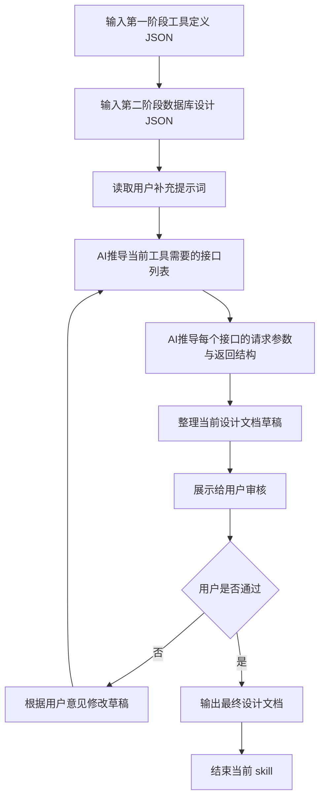

## 输入:
* 第一阶段输出的工具定义 JSON
* 第二阶段输出的数据库设计 JSON
* 用户当前补充的提示词（用于修正、细化、微调设计文档方案）

## 逻辑：
* 通过结合第一阶段和第二阶段的结果，生成接口设计文档。
* 从第一阶段输出结果收集以下内容：
  * `tool_key`
  * `tool_name`
  * `group`
  * `features`
* 从第二阶段输出结果收集以下内容：
  * `object_key`
  * `tables.fields`
* 结合规则见`规则`板块

## skill流程:

## 规则：

* 只基于当前输入生成设计文档，不得擅自补充未被输入支持的接口。
* 缺信息时，只能追问当前最必要的问题。
* 审核阶段应先展示草稿，再等待用户确认。
* 在用户明确表示“通过”“可以”“没问题”之前，不得输出最终设计文档。
* 最终输出时，只输出设计文档，不附加任何解释文字以及脏内容。
* 最终设计文档必须输出为 HTML table。
* 当同一工具下存在多个接口时，工具名称列必须使用 HTML 的 `rowspan` 进行合并单元格。
* 新建工具的统一协议规则：

  * 只要是新建工具，接口协议必须使用统一结构。
  * 所有带请求体的接口，`Body参数` 必须按统一请求结构展开。
  * 所有接口的成功响应必须按统一成功响应结构展开。
  * 所有接口的失败响应必须按统一失败响应结构展开。

## 输出字段说明：

* `工具名称`：填写该接口所属工具名称，格式为:`第一阶段输出的tool_key(第一阶段输出中的tool_name)`。
* `API地址`：填写接口路径，前缀固定为`/api/{版本号}/{group}/{tool_key}`。
* `请求方式`：根据接口动作填写对应的 HTTP 方法。
* `Path参数`：填写路径中的动态参数，例如 `{id}`。
* `Query参数`：填写查询字符串中的参数，例如分页、筛选条件。
* `Body参数`：填写请求体中的字段。

  * 对于新建工具，所有带请求体的接口必须按以下统一请求结构展开：

    * `request_id`
    * `ts`
    * `payload`
* `Header参数`：填写请求头中的参数，例如 `Authorization`。
* `权限要求`：填写可以访问的用户类型。
* `成功返回`：必须展开到字段级，逐项列出成功响应中的字段。

  * 对于新建工具，必须按以下统一成功响应结构展开：

    * `version`
    * `success`
    * `code`
    * `message`
    * `request_id`
    * `ts`
    * `data`
* `失败返回`：必须展开到字段级，逐项列出失败响应中的字段。

  * 对于新建工具，必须按以下统一失败响应结构展开：

    * `version`
    * `success`
    * `code`
    * `message`
    * `request_id`
    * `ts`
    * `error.details`
* `备注`：填写接口用途、特殊说明或补充信息，写法不限制。

## 固定输出格式(示例)：

<table>
  <thead>
    <tr>
      <th>工具名称</th>
      <th>API地址</th>
      <th>请求方式</th>
      <th>Path参数</th>
      <th>Query参数</th>
      <th>Body参数</th>
      <th>Header参数</th>
      <th>权限要求</th>
      <th>成功返回</th>
      <th>失败返回</th>
      <th>备注</th>
    </tr>
  </thead>
  <tbody>
    <tr>
      <td rowspan="5">weekly-report-assistant(周报助手)</td>
      <td>/api/v1/collaboration-tools/weekly-report-assistant</td>
      <td>GET</td>
      <td>无</td>
      <td>page:int page_size:int</td>
      <td>无</td>
      <td>Authorization:string</td>
      <td>登录用户</td>
      <td>version:string success:boolean code:string message:string request_id:string ts:number data:list</td>
      <td>version:string success:boolean code:string message:string request_id:string ts:number error.details:object</td>
      <td>周报列表查询</td>
    </tr>
    <tr>
      <td>/api/v1/collaboration-tools/weekly-report-assistant/{id}</td>
      <td>GET</td>
      <td>id:bigint</td>
      <td>无</td>
      <td>无</td>
      <td>Authorization:string</td>
      <td>登录用户</td>
      <td>version:string success:boolean code:string message:string request_id:string ts:number data.id:bigint data.title:varchar data.content:text</td>
      <td>version:string success:boolean code:string message:string request_id:string ts:number error.details:object</td>
      <td>周报详情查询</td>
    </tr>
    <tr>
      <td>/api/v1/collaboration-tools/weekly-report-assistant</td>
      <td>POST</td>
      <td>无</td>
      <td>无</td>
      <td>request_id:string ts:number payload.title:varchar payload.content:text payload.week:varchar payload.author_id:bigint</td>
      <td>Authorization:string</td>
      <td>登录用户</td>
      <td>version:string success:boolean code:string message:string request_id:string ts:number data.id:bigint</td>
      <td>version:string success:boolean code:string message:string request_id:string ts:number error.details:object</td>
      <td>新建周报</td>
    </tr>
    <tr>
      <td>/api/v1/collaboration-tools/weekly-report-assistant/{id}</td>
      <td>PUT</td>
      <td>id:bigint</td>
      <td>无</td>
      <td>request_id:string ts:number payload.title:varchar payload.content:text payload.week:varchar</td>
      <td>Authorization:string</td>
      <td>登录用户</td>
      <td>version:string success:boolean code:string message:string request_id:string ts:number data.id:bigint</td>
      <td>version:string success:boolean code:string message:string request_id:string ts:number error.details:object</td>
      <td>编辑周报</td>
    </tr>
    <tr>
      <td>/api/v1/collaboration-tools/weekly-report-assistant/{id}/submit</td>
      <td>POST</td>
      <td>id:bigint</td>
      <td>无</td>
      <td>request_id:string ts:number payload:object</td>
      <td>Authorization:string</td>
      <td>登录用户</td>
      <td>version:string success:boolean code:string message:string request_id:string ts:number data.id:bigint data.status:varchar</td>
      <td>version:string success:boolean code:string message:string request_id:string ts:number error.details:object</td>
      <td>提交周报</td>
    </tr>
  </tbody>
</table>

