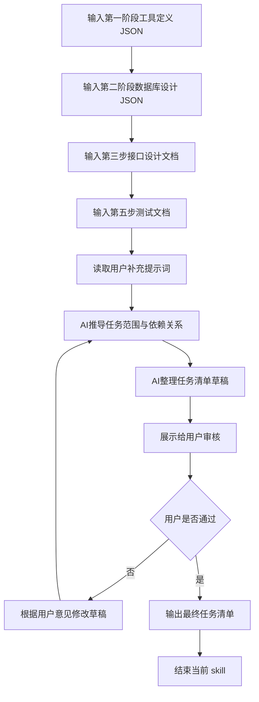

## 输入:

* 第一阶段输出的工具定义 JSON
* 第二阶段输出的数据库设计 JSON
* 第三步输出的接口设计文档 HTML 表格内容
* 第五步输出的测试文档内容
* 用户当前补充的提示词（用于修正、细化、微调任务清单方案）

## 逻辑：

* 通过结合第一阶段、第二阶段、第三阶段和第五阶段的结果，生成任务清单文档。
* 从第一阶段输出结果收集以下内容：

  * `tool_key`
  * `tool_name`
  * `group`
  * `features`
  * `fields`
* 从第二阶段输出结果收集以下内容：

  * `object_key`
  * `tables`
* 从第三阶段输出结果收集以下内容：

  * 接口列表
  * 请求方式
  * 请求参数
  * 成功返回
  * 失败返回
* 从第五阶段输出结果收集以下内容：

  * 前端测试点
  * 后端测试点
  * 接口测试点
  * 联调测试点
  * 验收标准
* 任务清单需要覆盖当前工具的前端开发、后端开发、联调、测试四类任务。
* 结合规则见 `规则` 板块。

## skill流程:

## 规则：

* 只基于当前输入生成任务清单，不得擅自补充未被输入支持的功能点。
* 任务清单必须围绕单个工具生成，不得混入其他工具的任务。
* 任务清单必须包含以下四类任务：

  * 前端任务
  * 后端任务
  * 联调任务
  * 测试任务
* `features` 中出现的每一个动作，都必须在任务清单中体现对应开发或测试任务。
* 如果第二阶段中存在新建表、扩展表、外键、索引、默认值等数据库设计信息，必须映射到对应后端任务中。
* 如果第三阶段中存在接口设计，则这些接口必须逐一映射到前端任务、后端任务或联调任务中。
* 如果第五阶段中存在测试点，则这些测试点必须逐一映射到测试任务中。
* 每条任务都必须包含以下字段：

  * `task_id`
  * `title`
  * `description`
  * `depends_on`
  * `done_when`
* `task_id` 必须在当前任务清单内唯一。
* `depends_on` 用于记录该任务依赖的其他任务编号；没有依赖时必须填写空数组。
* `done_when` 用于描述该任务完成的验收条件，必须可检查、可判断。
* 每一轮对话只专注于一个问题，内容需要简洁，禁止输出过多行数导致刷屏。
* 缺信息时，只能追问当前最必要的问题。
* 审核阶段应先展示草稿，再等待用户确认。
* 在用户明确表示“通过”“可以”“没问题”之前，不得输出最终任务清单。
* 最终输出时，只输出任务清单，不附加任何解释文字以及脏内容。

## 固定输出格式(示例)：

# weekly_report_assistant 任务清单

## 一、工具基础信息

* tool_key: `weekly_report_assistant`
* tool_name: `周报助手`
* group: `collaboration_tools`
* object_key: `weekly_report`

## 二、前端任务

* `FE-001`

  * `title`: 创建周报列表页
  * `description`: 实现周报列表页面，支持分页展示、进入详情页。
  * `depends_on`: []
  * `done_when`: 列表页可正常展示接口返回数据，并支持分页切换。
* `FE-002`

  * `title`: 创建周报详情页
  * `description`: 实现周报详情页面，展示单条周报完整信息。
  * `depends_on`: ["FE-001", "BE-002"]
  * `done_when`: 页面可根据 id 正确获取并展示详情数据。
* `FE-003`

  * `title`: 创建周报新建与编辑表单
  * `description`: 实现周报创建、编辑页面及表单交互。
  * `depends_on`: ["BE-003", "BE-004"]
  * `done_when`: 表单字段与接口设计一致，提交成功后页面状态正确更新。

## 三、后端任务

* `BE-001`

  * `title`: 创建 weekly_report 数据表
  * `description`: 根据数据库设计定义创建 weekly_report 表及字段。
  * `depends_on`: []
  * `done_when`: 数据表、字段、索引、约束与数据库设计文档一致。
* `BE-002`

  * `title`: 实现周报详情接口
  * `description`: 实现详情查询接口，支持根据 id 获取单条周报。
  * `depends_on`: ["BE-001"]
  * `done_when`: 接口返回结构与设计文档一致，详情测试通过。
* `BE-003`

  * `title`: 实现周报创建接口
  * `description`: 实现周报新增接口，支持统一请求体结构。
  * `depends_on`: ["BE-001"]
  * `done_when`: 接口支持创建数据，成功返回和失败返回结构符合协议。
* `BE-004`

  * `title`: 实现周报编辑接口
  * `description`: 实现周报编辑接口，支持更新已有周报。
  * `depends_on`: ["BE-001"]
  * `done_when`: 接口支持更新数据，返回结构符合设计文档。

## 四、联调任务

* `INT-001`

  * `title`: 联调周报列表接口与前端列表页
  * `description`: 确保列表页字段、分页参数、返回结构与接口完全一致。
  * `depends_on`: ["FE-001", "BE-001"]
  * `done_when`: 前端列表页通过真实接口展示数据，无 mock 依赖。
* `INT-002`

  * `title`: 联调周报表单与创建编辑接口
  * `description`: 确保表单字段、请求体结构、错误提示与后端接口一致。
  * `depends_on`: ["FE-003", "BE-003", "BE-004"]
  * `done_when`: 创建和编辑流程在真实接口下可完整跑通。

## 五、测试任务

* `TEST-001`

  * `title`: 编写并运行 Playwright 测试
  * `description`: 为列表、详情、创建、编辑、提交等核心流程编写前端自动化测试。
  * `depends_on`: ["FE-001", "FE-002", "FE-003", "INT-001", "INT-002"]
  * `done_when`: Playwright 测试全部通过，无失败用例。
* `TEST-002`

  * `title`: 编写并运行 pytest 测试
  * `description`: 为列表、详情、创建、编辑、提交等后端接口编写自动化测试。
  * `depends_on`: ["BE-002", "BE-003", "BE-004"]
  * `done_when`: pytest 测试全部通过，无失败用例。
* `TEST-003`

  * `title`: 清理测试数据
  * `description`: 删除测试过程中创建的周报测试数据，避免污染开发库。
  * `depends_on`: ["TEST-001", "TEST-002"]
  * `done_when`: 开发库中不存在本轮测试产生的脏数据。
