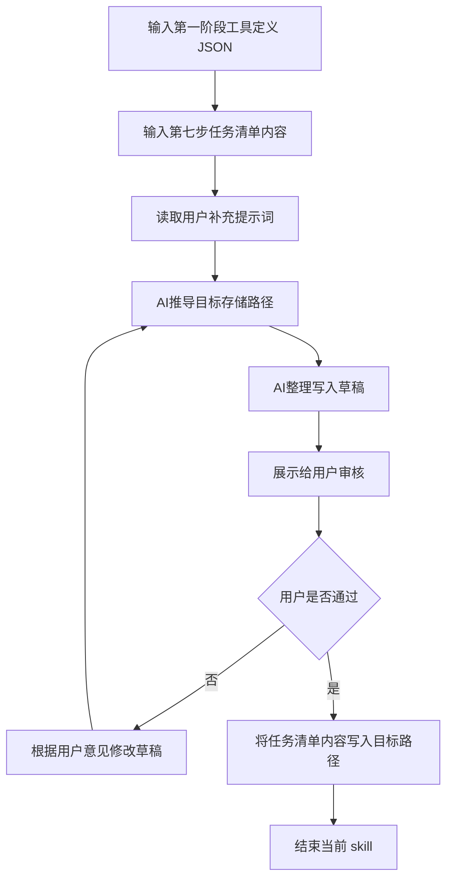

## 输入:

* 第七步产出的任务清单内容
* 第一阶段输出的工具定义 JSON
* 用户当前补充的提示词（用于修正、细化、微调文档存储方案）

## 逻辑：

* 通过结合第七步任务清单内容和第一阶段工具定义结果，直接将任务清单写入目标路径。
* 从第一阶段输出结果收集以下内容：

  * `group`
  * `tool_key`
* 从第七步输出结果收集以下内容：

  * 任务清单内容
* 根据统一存储规则，推导目标存储路径。
* 结合规则见 `规则` 板块。

## skill流程:

## 规则：

* 只基于当前输入执行任务清单存储，不得擅自补充未被输入支持的内容。
* 任务清单存储路径固定为：`docs/tasks/{group}/{tool_key}.md`
* `group` 来自第一阶段输入，不得擅自修改。
* `tool_key` 来自第一阶段输入，不得擅自修改。
* 目标路径必须严格按照固定路径规则推导。
* 写入内容必须为第七步产出的完整任务清单内容，不得删改结构。
* 如果目标文件已存在，且用户没有明确要求保留旧内容，默认直接覆盖。
* 每一轮对话只专注于一个问题，内容需要简洁，禁止输出过多行数导致刷屏。
* 缺信息时，只能追问当前最必要的问题。
* 审核阶段应先展示写入草稿，再等待用户确认。
* 在用户明确表示“通过”“可以”“没问题”之前，不得执行写入。
* 最终阶段不输出存储结果 JSON。
* AI 应直接将任务清单内容写入目标路径。
* 写入成功后结束当前 skill。
