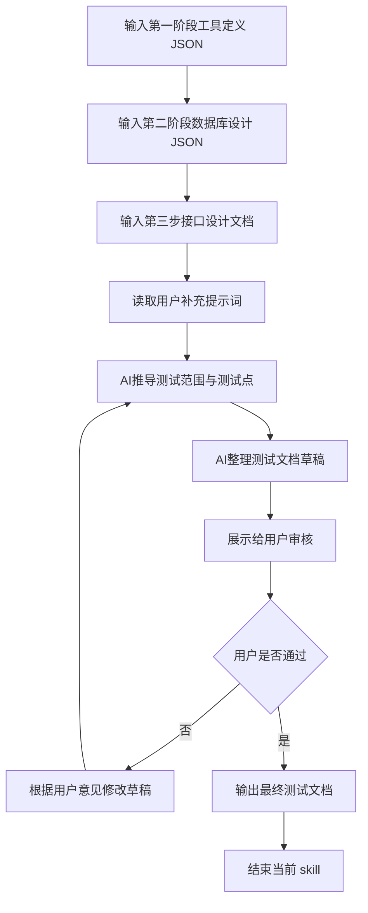

## 输入:

* 第一阶段输出的工具定义 JSON
* 第二阶段输出的数据库设计 JSON
* 第三步输出的接口设计文档 HTML 表格内容
* 用户当前补充的提示词（用于修正、细化、微调测试文档方案）

## 逻辑：

* 通过结合第一阶段、第二阶段和第三阶段的结果，生成测试文档。
* 从第一阶段输出结果收集以下内容：

  * `tool_key`
  * `tool_name`
  * `group`
  * `features`
  * `fields`
* 从第二阶段输出结果收集以下内容：

  * `object_key`
  * `tables`
* 从第三阶段输出结果收集以下内容：

  * 接口列表
  * 请求方式
  * 请求参数
  * 成功返回
  * 失败返回
* 测试文档需要覆盖当前工具的前端测试、后端测试、接口测试、联调测试、异常场景测试和验收标准。
* 结合规则见 `规则` 板块。

## skill流程:

## 规则：

* 只基于当前输入生成测试文档，不得擅自补充未被输入支持的功能点。
* 测试文档必须围绕单个工具生成，不得混入其他工具的测试内容。
* 测试文档必须覆盖当前工具的核心功能动作。
* `features` 中出现的每一个动作，都必须在测试文档中体现对应测试点。
* 测试文档必须同时覆盖前端测试、后端测试、接口测试、联调测试和验收标准。
* 前端测试必须默认要求使用 Playwright。
* 后端测试必须默认要求使用 pytest。
* 允许先交代码再补测试，但最终交付前不得存在失败测试。
* 测试允许依赖开发库，但测试产生的数据必须被清理，不得留下脏数据。
* 如果第三步接口设计文档中存在接口，则这些接口必须逐一映射到测试点。
* 如果存在 create、update、delete、submit、approve、generate、import、export 等动作，必须补充成功场景和失败场景测试。
* 缺信息时，只能追问当前最必要的问题。
* 每一轮对话只专注于一个问题，内容需要简洁，禁止输出过多行数导致刷屏。
* 审核阶段应先展示草稿，再等待用户确认。
* 在用户明确表示“通过”“可以”“没问题”之前，不得输出最终测试文档。
* 最终输出时，只输出测试文档，不附加任何解释文字以及脏内容。

## 固定输出格式(示例)：

# weekly_report_assistant 测试文档

## 一、工具基础信息

* tool_key: `weekly_report_assistant`
* tool_name: `周报助手`
* group: `collaboration_tools`
* object_key: `weekly_report`

## 二、测试范围

* 前端页面测试
* 后端接口测试
* 数据库相关测试
* 联调测试
* 异常场景测试
* 验收测试

## 三、前端测试点

* 列表页可正常加载，并正确展示分页数据
* 详情页可正常展示单条周报详情
* 新建周报表单可正常提交
* 编辑周报表单可正常回填并提交
* 提交周报按钮点击后可正确变更状态
* 未登录时访问页面会被拦截并跳转登录
* 接口异常时页面能正确展示错误提示

## 四、后端测试点

* `GET /api/v1/collaboration_tools/weekly_report_assistant` 返回列表成功
* `GET /api/v1/collaboration_tools/weekly_report_assistant/{id}` 返回详情成功
* `POST /api/v1/collaboration_tools/weekly_report_assistant` 创建成功
* `PUT /api/v1/collaboration_tools/weekly_report_assistant/{id}` 更新成功
* `POST /api/v1/collaboration_tools/weekly_report_assistant/{id}/submit` 提交成功
* 非法参数时返回失败响应结构
* 不存在的 id 查询时返回失败响应结构

## 五、接口测试点

* 列表接口：

  * 正常分页查询
  * 非法分页参数
  * 空数据场景
* 详情接口：

  * 正常查询
  * id 不存在
  * id 类型错误
* 新建接口：

  * 必填字段完整时创建成功
  * 缺少必填字段时创建失败
  * 字段类型错误时创建失败
* 编辑接口：

  * 正常更新成功
  * 更新不存在记录失败
* 提交接口：

  * 正常提交成功
  * 重复提交失败

## 六、联调测试点

* 前端列表页与列表接口字段保持一致
* 前端详情页与详情接口字段保持一致
* 前端新建表单字段与后端请求体字段保持一致
* 前端错误提示与后端失败返回结构保持一致
* 权限失效时，前端统一清理 token 并跳转登录

## 七、测试数据要求

* 测试前准备可用测试账号
* 测试中创建的数据必须可追踪
* 测试后必须删除测试过程中产生的数据
* 不允许在开发库中残留脏测试数据

## 八、验收标准

* Playwright 测试可运行并通过
* pytest 测试可运行并通过
* 核心功能流程可真实联调通过
* 不允许只交 mock 页面
* 不允许带着失败测试交付
