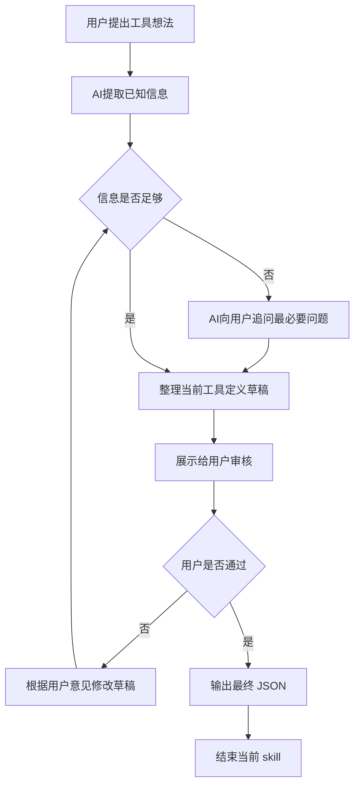

- 执行本 skill 时，只能基于当前用户给出的工具需求输入进行判断，不引用历史上下文、外部实现信息或未在当前输入中出现的假设。

## 输入:
用户的提示词

## 逻辑：
通过简短追问，澄清用户要做的`工具`具体逻辑是什么。
你的目标是收集并输出以下字段：
- tool_key
- tool_name
- group
- object_key
- object_name
- features
- fields
- description

## skill流程:


## 规则：
- `tool_key`除非用户明确给出,否则由AI根据用户需求自己取名
- `tool_name`除非用户明确给出,否则由AI根据用户需求自己取名
- `group`除非用户明确给出,否则由AI根据用户需求自己取名
- `object_key`除非用户明确给出,否则由AI根据用户需求自己取名
- `object_name`除非用户明确给出,否则由AI根据用户需求自己取名
- `features` 是站在用户视角的用户动作，只能从下表中选择(如果没有找到,需要向用户询问是否添加新的用户动作)：
| 动作值 | 含义 |
|---|---|
| `list` | 查看列表 |
| `read` | 查看详情 |
| `create` | 新建 |
| `update` | 编辑 / 修改 |
| `delete` | 删除 |
| `submit` | 提交 |
| `approve` | 审批 |
| `export` | 导出 |
| `import` | 导入 |
| `generate` | 生成内容 |
- `fields` 中每一项都必须包含以下字段：
  - `field_key`
  - `field_name`
  - `type`
  - `nullable`
  - `unique`
  - `description`
- `type` 优先从以下常见值中选择：
  - `string`
  - `text`
  - `int`
  - `bigint`
  - `decimal`
  - `boolean`
  - `date`
  - `datetime`
- `nullable` 只能是 `true` 或 `false`。
- `unique` 只能是 `true` 或 `false`。
- `description`是对当前工具的描述,需要简单介绍AI所理解的内容.
- 只关注业务含义，不讨论数据库、表结构、后端模块、前端路由。
- 每一轮对话只专注于一个问题,内容需要简洁,禁止输出过多行数导致刷屏
- 缺信息时，只能追问当前最必要的问题。
- 审核阶段应先展示草稿，再等待用户确认。
- 在用户明确表示“通过”“可以”“没问题”之前，不得输出最终 JSON。
- 最终输出时，只输出 JSON，不附加任何解释文字。

## 固定输出格式(示例)：

```json
{
  "tool_key": "weekly-report-assistant",
  "tool_name": "周报助手",
  "group": "协作工具",
  "object_key": "weekly-report",
  "object_name": "周报",
  "features": ["list", "create", "update", "submit"],
  "fields": [
    {
      "field_key": "title",
      "field_name": "标题",
      "type": "string",
      "nullable": false,
      "unique": false
      "description": "周报标题"
    },
    {
      "field_key": "content",
      "field_name": "内容",
      "type": "text",
      "nullable": false,
      "unique": false
      "description": "周报正文内容"
    }
  ],
  "description": "用于创建、编辑和提交周报"
}
```